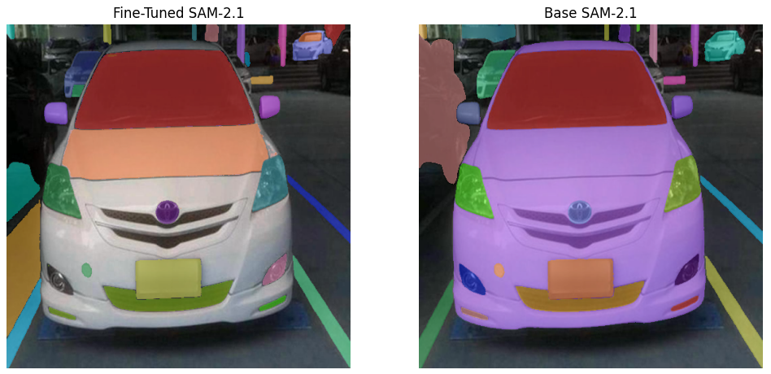

# SAM-2.1_fine_tuning

## Based on this repo: https://github.com/roboflow/notebooks/blob/main/notebooks/fine-tune-sam-2.1.ipynb
## Code changed to work on GTX960 4gb. Use provided "train.yaml" file instead of this in sam2 directory

## Results:

As we can see fine-tuned model can predict more car parts than based model.
